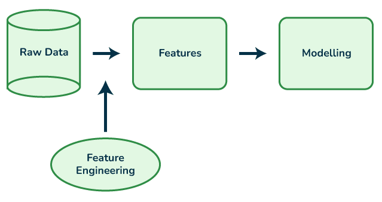

# Feature Engineering (BCG X Data Science Project Part 2)

## Introduction
This is Part 2 of a project from the [BCG X Data Science micro-internship](https://www.theforage.com/simulations/bcg/data-science-ccdz). The Boston Consulting Group (BCG) is an American global consulting firm that  partners with leaders in business and society to tackle their most important challenges. It is one of the world's 3 largest consulting firms along with McKinsey & Company and Bain & Company. BCG X is a new initiative from BCG that combines the firm's consulting expertise with tech building and design.

In this task, I take on the role of a junior data analyst employed at BCG X. BCG X's client, a major gas and electricity utility called PowerCo, is concerned about their customers leaving for better offers from other energy providers. **In this part of the project, I will conduct feature engineering by manipulating and transforming raw data to create new features to improve the performance of the machine learning model we will be using in part 3.**

## Problem Statement
PowerCo has expressed concern over their customers leaving them for better offers from competing energy companies. This concern is exacerbated by the fact that the energy market has had a lot of change in recent years and there are more options than ever for customers to choose from. During a meeting with the Associate Director of the Data Science team, **one potential reason for churn is price sensitivity.** I am tasked with investigating this hypothesis. **To improve the performance of the machine learning model we will be using in part 3, I will conduct feature engineering on the dataset and create new features using the current dataset.**

## Skills Demonstrated
* Python
* Feature Engineering
* Data Manipulation
* Data Visualization

## Data Sourcing
This data was provided to me by the BCG X Data Science microinternship hosted by Forage. A copy of the data is included in this repository under the file name: client_data (1).csv and price_data (1).csv.

## Data Attributes
The data provided by PowerCo is separated into 2 files: client_data(1).csv and price_data(1).csv. The client data contains information about power consumption, sales channels, forecasted power consumption, and whether the client has churned or not. Each row contains data for 1 client.

The price data contains information on the price of energy that each client pays during various peak times of the day. Most clients will have 12 rows of data, one row for each month in a year.

Attributes for client data:
* id - Client company identifier.
* channel_sales - Code of the sales channel.
* cons_12m - Electricity consumption of the past 12 months.
* cons_gas_12m - Gas consumption of the past 12 months.
* cons_last_month - Electricity consumption of the last month.
* date_activ - Date of activation of the contract.
* date_end - Registered date of the end of the contract.
* date_modif_prod - Date of the last modification of the product.
* date_renewal - Date of the next contract renewal.
* forecast_cons_12m - FForecasted electricity consumption for next 12 months.
* forecast_cons_year - Forecasted electricity consumption for the next calendar year.
* forecast_discount_energy - Forecasted value of current discount.
* forecast_meter_rent_12m - Forecasted bill of meter rental for the next 2 months.
* forecast_price_energy_off_peak - Forecasted energy price for 1st period (off peak).
* forecast_price_energy_peak - Forecasted energy price for 2nd period (peak).
* forecast_price_pow_off_peak - Forecasted power price for 1st period (off peak).
* has_gas - Indicated if client is also a gas client.
* imp_cons - Current paid consumption.
* margin_gross_pow_ele - Gross margin on power subscription.
* margin_net_pow_ele - Net margin on power subscription.
* nb_prod_act - Number of active products and services.
* net_margin - Total net margin.
* num_years_antig - Antiquity of the client (in number of years).
* origin_up - Code of the electricity campaign the customer first subscribed to.
* pow_max - Subscribed power.
* churn - Has the client churned over the next 3 months.

Attributes for price data:
* id - Client company identifier.
* price_date - Reference date.
* price_off_peak_var - Price of energy for the 1st period (off peak).
* price_peak_var - Price of energy for the 2nd period (peak).
* price_mid_peak_var - Price of energy for the 3rd period (mid peak).
* price_off_peak_fix - Price of power for the 1st period (off peak).
* price_peak_fix - Price of power for the 2nd period (peak).
* price_mid_peak_fix - Price of power for the 3rd period (mid peak).

## Feature Engineering and Data Visualizations
**Feature engineering is the process of selecting, manipulating and transforming raw data into features that can be used in supervised machine learning. A feature is any measurable input that can be used in a predictive model (each column that make up the data is a feature).**

**Supervised machine learning is the creation of data models by using labeled datasets (column names are the labels) to train a model to predict outcomes.**

A copy of this analysis is included in this repository under the file name: James Weber Feature Engineering.ipynb.

### 1. Importing Libraries and Data
We must first import libraries which contains the commands we need for feature engineering.
Then we import the data from the client_data(1).csv and price_data(1).csv files into dataframes.

```
# Importing libraries

import matplotlib.pyplot as plt
import seaborn as sns
import pandas as pd

# Use the read_csv() command to import .csv files.
# Create a client_df dataframe for the client data and a price_df dataframe for the price data.

client_df = pd.read_csv(r'C:/Users/jwebe/Desktop/client_data (1).csv')
price_df = pd.read_csv(r'C:/Users/jwebe/Desktop/price_data (1).csv')
```
### 2. 
