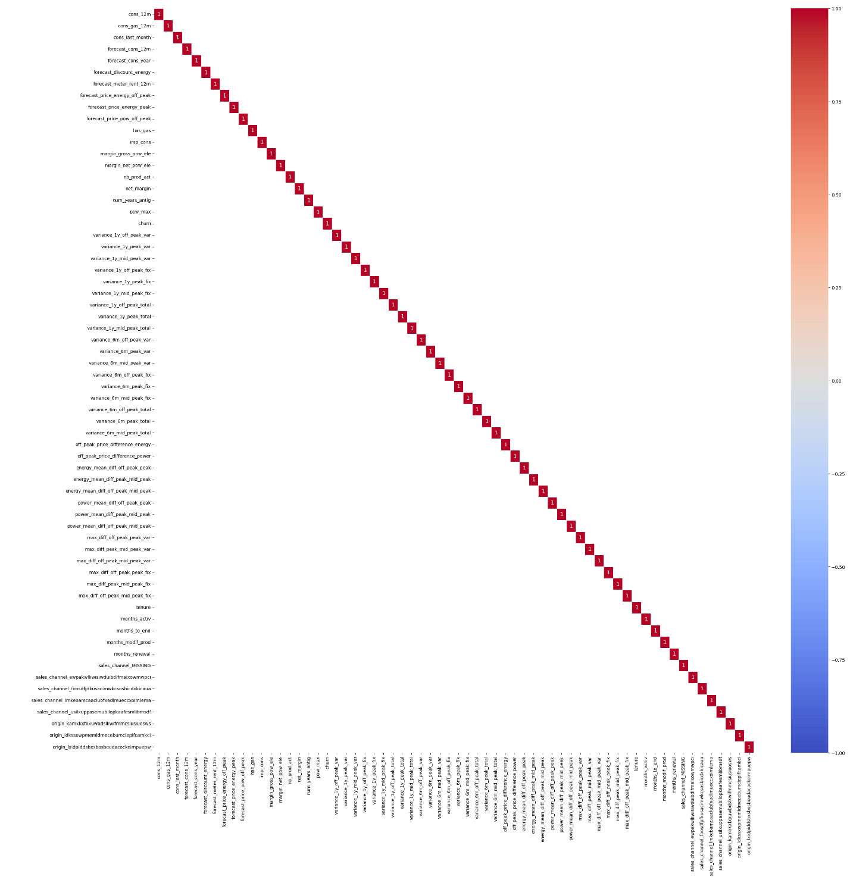

# Feature Engineering (BCG X Data Science Project Part 2)

## Introduction
This is Part 2 of a project from the [BCG X Data Science micro-internship](https://www.theforage.com/simulations/bcg/data-science-ccdz). The Boston Consulting Group (BCG) is an American global consulting firm that  partners with leaders in business and society to tackle their most important challenges. It is one of the world's 3 largest consulting firms along with McKinsey & Company and Bain & Company. BCG X is a new initiative from BCG that combines the firm's consulting expertise with tech building and design.

In this task, I take on the role of a junior data analyst employed at BCG X. BCG X's client, a major gas and electricity utility called PowerCo, is concerned about their customers leaving for better offers from other energy providers. **In this part of the project, I will conduct feature engineering by manipulating and transforming raw data to create new features to improve the performance of the machine learning model we will be using in part 3.**

## Problem Statement
PowerCo has expressed concern over their customers leaving them for better offers from competing energy companies. This concern is exacerbated by the fact that the energy market has had a lot of change in recent years and there are more options than ever for customers to choose from. During a meeting with the Associate Director of the Data Science team, **one potential reason for churn is price sensitivity.** I am tasked with investigating this hypothesis. **We will use a predictive machine learning model to determine what features are most influential to customer churn. To improve the performance of the machine learning model, which we will be using in part 3, I will conduct feature engineering on the dataset and create new features using the current dataset.**

## Skills Demonstrated
* Python
* Juypiter Notebook
* Feature Engineering
* Data Manipulation
* Data Visualization

## Data Sourcing
This data was provided to me by the BCG X Data Science micro-internship hosted by Forage. A copy of the data is included in this repository under the file name: client_data (1).csv and price_data (1).csv.

## Data Attributes
The data provided by PowerCo is separated into 2 files: client_data(1).csv and price_data(1).csv. The client data contains information about power consumption, sales channels, forecasted power consumption, and whether the client has churned or not. Each row contains data for 1 client.

The price data contains information on the price of energy that each client pays during various peak times of the day. Most clients will have 12 rows of data, one row for each month in a year.

Attributes for client data:
* id - Client company identifier.
* channel_sales - Code of the sales channel.
* cons_12m - Electricity consumption of the past 12 months.
* cons_gas_12m - Gas consumption of the past 12 months.
* cons_last_month - Electricity consumption of the last month.
* date_activ - Date of activation of the contract.
* date_end - Registered date of the end of the contract.
* date_modif_prod - Date of the last modification of the product.
* date_renewal - Date of the next contract renewal.
* forecast_cons_12m - FForecasted electricity consumption for next 12 months.
* forecast_cons_year - Forecasted electricity consumption for the next calendar year.
* forecast_discount_energy - Forecasted value of current discount.
* forecast_meter_rent_12m - Forecasted bill of meter rental for the next 2 months.
* forecast_price_energy_off_peak - Forecasted energy price for 1st period (off peak).
* forecast_price_energy_peak - Forecasted energy price for 2nd period (peak).
* forecast_price_pow_off_peak - Forecasted power price for 1st period (off peak).
* has_gas - Indicated if client is also a gas client.
* imp_cons - Current paid consumption.
* margin_gross_pow_ele - Gross margin on power subscription.
* margin_net_pow_ele - Net margin on power subscription.
* nb_prod_act - Number of active products and services.
* net_margin - Total net margin.
* num_years_antig - Antiquity of the client (in number of years).
* origin_up - Code of the electricity campaign the customer first subscribed to.
* pow_max - Subscribed power.
* churn - Has the client churned over the next 3 months.

Attributes for price data:
* id - Client company identifier.
* price_date - Reference date.
* price_off_peak_var - Price of energy for the 1st period (off peak).
* price_peak_var - Price of energy for the 2nd period (peak).
* price_mid_peak_var - Price of energy for the 3rd period (mid peak).
* price_off_peak_fix - Price of power for the 1st period (off peak).
* price_peak_fix - Price of power for the 2nd period (peak).
* price_mid_peak_fix - Price of power for the 3rd period (mid peak).

## Feature Engineering and Data Visualizations
**Feature engineering is the process of selecting, manipulating and transforming raw data into features that can be used in supervised machine learning. A feature is any measurable input that can be used in a machine learning model. The features we have in our dataset are listed in the Data Attribures section above.**

**Supervised machine learning is the creation of data models by using labeled datasets to train a model to predict outcomes.**

A copy of this feature engineering project is included in this repository under the file name: James Weber Feature Engineering.ipynb.

### 1. Importing Libraries and Data
We must first import libraries which contains the commands we need for feature engineering.
Then we import the data from the client_data(1).csv and price_data(1).csv files into client_df and price_df dataframes respectively.

```
# Importing libraries

import matplotlib.pyplot as plt
import seaborn as sns
import pandas as pd

# Use the read_csv() command to import .csv files.
# Create a client_df dataframe for the client data and a price_df dataframe for the price data.

client_df = pd.read_csv(r'C:/Users/jwebe/Desktop/client_data (1).csv')
price_df = pd.read_csv(r'C:/Users/jwebe/Desktop/price_data (1).csv')
```

### 2. Creating Price Sensitivty Features: Price Variance During Peak Hours
**When speaking wtth the Associate Director of the Data Science team, one hypothesis for PowerCo's customer churn is price sensitivity,** the degree to which demand changes when the cost of a product or service changes. However, **there are no features in the raw data that reflect price change. We will use feature engineering techniques to create features that reflect price change.**

**One feature related to price change is the variance of price throughout the year between peak hours.** Variance is the spread between numbers in a dataset. **Variance will give us an inidcation of how much the price has changed over a year. We will also include the variance for the last 6 months in the year.**

The price_df dataframe contains the price of energy and the price of power and during various peak hours (off peak, peak, and mid peak). To make the price_df dataframe more complete, we will sum together the price of energy and power to calculate a total price during peak hours. A new feature will be added to the price_df dataframe for each total price calculated.

```
# The price_df dataframe contains data for the price of energy and power for each customer.
# The price changes every month and during different peak periods (peak, off peak, and mid peak).
# Along with finding the variance in price for energy and power, we should also find the variance in price for the total.
# Create columns that contain total price by adding energy price with power price.

price_df['price_off_peak_total'] = price_df['price_off_peak_var'] + price_df['price_off_peak_fix']
price_df['price_peak_total'] = price_df['price_peak_var'] + price_df['price_peak_fix']
price_df['price_mid_peak_total'] = price_df['price_mid_peak_var'] + price_df['price_mid_peak_fix']
```
Three features are added to the price_df dataframe: 
* price_off_peak_total - The price of energy and power during off peak hours.
* price_peak_total - The price of energy and power during peak hours.
* price_mid_peak_total - The price of energy and power during mid peak hours.

The code below will calculate the energy, power, and total price variance throughout the year during peak hours. A new feature will be added to the client_df dataframe for each price variance calculated.

```
# Use the .groupby() command to group the data in the price_df dataframe by the id column.
# Use the .agg() command to use multiple aggregate functions (var) across multiple columns.
# Use the .reset_index() command to insert the outputs into a dataframe and reset the index column.

price_variance_1year = price_df.groupby('id').agg({'price_off_peak_var': 'var', 
                                                   'price_peak_var': 'var', 
                                                   'price_mid_peak_var': 'var', 
                                                   'price_off_peak_fix': 'var', 
                                                   'price_peak_fix': 'var', 
                                                   'price_mid_peak_fix': 'var', 
                                                   'price_off_peak_total': 'var', 
                                                   'price_peak_total': 'var', 
                                                   'price_mid_peak_total': 'var'}).reset_index()

# Use the .rename() command to rename columns.

price_variance_1year.rename(columns = {'price_off_peak_var':'variance_1y_off_peak_var', 
                                       'price_peak_var':'variance_1y_peak_var', 
                                       'price_mid_peak_var':'variance_1y_mid_peak_var', 
                                       'price_off_peak_fix':'variance_1y_off_peak_fix', 
                                       'price_peak_fix':'variance_1y_peak_fix', 
                                       'price_mid_peak_fix':'variance_1y_mid_peak_fix', 
                                       'price_off_peak_total':'variance_1y_off_peak_total', 
                                       'price_peak_total':'variance_1y_peak_total', 
                                       'price_mid_peak_total':'variance_1y_mid_peak_total'}, 
                                       inplace = True)

client_df = pd.merge(client_df, 
                     price_variance_1year, 
                     on = 'id')
```

Nine features are added to the client_df dataframe:
* variance_1y_off_peak_var - The price variance of energy during off peak hours for 1 year.
* variance_1y_peak_var - The price variance of energy during peak hours for 1 year.
* variance_1y_mid_peak_var - The price variance of energy during mid peak hours for 1 year.
* variance_1y_off_peak_fix - The price variance of power during off peak hours for 1 year.
* variance_1y_peak_fix - The price variance of power during peak hours for 1 year.
* variance_1y_mid_peak_fix - The price variance of power during mid peak hours for 1 year.
* variance_1y_off_peak_total - The price variance of both energy and power during off peak hours for 1 year.
* variance_1y_peak_total - The price variance of both energy and power during peak hours for 1 year.
* variance_1y_mid_peak_total - The price variance of both energy and power during mid peak hours for 1 year.

We will also calculate the price variance for the last 6 months of the year and add the price variances to the3 client_df dataframe.
```
# Use the .groupby() command to group the data in the price_df dataframe by the id column.
# Use the .tail(6) command after the .groupby() command to only include the last 6 months of the year per customer.
# Use the .agg() command to use multiple aggregate functions (var) across multiple columns.
# Use the .reset_index() command to insert the outputs into a dataframe and reset the index column.

price_variance_6months = price_df.groupby('id').tail(6).groupby('id').agg({'price_off_peak_var': 'var', 
                                                                           'price_peak_var': 'var', 
                                                                           'price_mid_peak_var': 'var', 
                                                                           'price_off_peak_fix': 'var', 
                                                                           'price_peak_fix': 'var', 
                                                                           'price_mid_peak_fix': 'var', 
                                                                           'price_off_peak_total': 'var', 
                                                                           'price_peak_total': 'var', 
                                                                           'price_mid_peak_total': 'var'}).reset_index()

# Use the .rename() command to rename columns.

price_variance_6months.rename(columns = {'price_off_peak_var':'variance_6m_off_peak_var', 
                                         'price_peak_var':'variance_6m_peak_var', 
                                         'price_mid_peak_var':'variance_6m_mid_peak_var', 
                                         'price_off_peak_fix':'variance_6m_off_peak_fix', 
                                         'price_peak_fix':'variance_6m_peak_fix', 
                                         'price_mid_peak_fix':'variance_6m_mid_peak_fix', 
                                         'price_off_peak_total':'variance_6m_off_peak_total', 
                                         'price_peak_total':'variance_6m_peak_total', 
                                         'price_mid_peak_total':'variance_6m_mid_peak_total'}, 
                                         inplace = True)

# Merge the client_df dataframe with the 6 month variance dataframes.

client_df = pd.merge(client_df, 
                     price_variance_6months, 
                     on = 'id')
```
Nine features are added to the client_df dataframe:
* variance_6m_off_peak_var - The price variance of energy during off peak hours for the last 6 months of the year.
* variance_6m_peak_var - The price variance of energy during peak hours for the last 6 months of the year.
* variance_6m_mid_peak_var - The price variance of energy during mid peak hours for the last 6 months of the year.
* variance_6m_off_peak_fix - The price variance of power during off peak hours for the last 6 months of the year.
* variance_6m_peak_fix - The price variance of power during peak hours for the last 6 months of the year.
* variance_6m_mid_peak_fix - The price variance of power during mid peak hours for the last 6 months of the year.
* variance_6m_off_peak_total - The price variance of both energy and power during off peak hours for the last 6 months of the year.
* variance_6m_peak_total - The price variance of both energy and power during peak hours for the last 6 months of the year.
* variance_6m_mid_peak_total - The price variance of both energy and power during mid peak hours for the last 6 months of the year.

**In summary, we:**
* Calculated the price variance of energy, power, and total price between different peak hours (off peak, peak, and mid peak) for 1 year.
* Calculated the price variance of energy, power, and total price between different peak hours (off peak, peak, and mid peak) for the last 6 months of the year.
* Added the price variances to the client_df dataframe. The client_df dataframe gains 18 new features.

### 3. Creating Price Sensitivty Features: Price Difference Beginning of Year to End of Year
**Another feature we can use to determine if price sensitivity may be a cause of churn is to determine the difference between the price of energy and power at the end of the year and the price of energy and power at the beginning of the year.**

The code below will create a dataframe called price_differences. The price_differences dataframe contains data on the price of energy and power during off peak hours at the beginning of the year (2015-01-01) and at the end of the year (2015-12-01).
```
# Create a dataframe that contains the customer ID, price dates, and the off peak prices.
# Use the .reset_index() command to insert the outputs into a dataframe and reset the index column.

monthly_price_by_id = price_df.groupby(['id', 'price_date']).agg({'price_off_peak_var': 'mean', 
                                                                  'price_off_peak_fix': 'mean'}).reset_index()

# Create dataframes for the price of power at the beginning of the year and the end of the year.
# Use the .groupby() command to group the data by the id column.
# Use the .first() and .last() command to select the first and last datapoint in the group.
# Use the .reset_index() command to insert the outputs into a dataframe and reset the index column.

beginning_of_year_prices = monthly_price_by_id.groupby('id').first().reset_index()
end_of_year_prices = monthly_price_by_id.groupby('id').last().reset_index()

# Remove the price_date columns from the beginning_of_year_prices and end_of_year_prices dataframes.
# Use the .drop() command to delete a column.

beginning_of_year_prices = beginning_of_year_prices.drop(columns = 'price_date')
end_of_year_prices = end_of_year_prices.drop(columns = 'price_date')

# Rename the price_off_peak_var and price_off_peak_fix columns.
# Use the .rename() command to rename columns.

beginning_of_year_prices.rename(columns = {'price_off_peak_var':'beginning_year_price_energy', 
                                           'price_off_peak_fix':'beginning_year_price_power'}, 
                                inplace = True)
end_of_year_prices.rename(columns = {'price_off_peak_var':'ending_year_price_energy', 
                                     'price_off_peak_fix':'ending_year_price_power'}, 
                          inplace = True)

# Merge the end_of_year_prices and beginning_of_year_price into a single dataframe using the .merge() command.
# Merge the dataframes using the id column.

price_differences = pd.merge(end_of_year_prices, beginning_of_year_prices, on = 'id')
```
Once the price_differences dataframe is created, we will the difference between the price at the end of the year and the price at the beginning of the year. The price differences will be added to the client_df dataframe.
```
# Calcualte the differences between the beginnig of year prices and end of year prices.

price_differences['off_peak_price_difference_energy'] = price_differences['ending_year_price_energy'] - price_differences ['beginning_year_price_energy']
price_differences['off_peak_price_difference_power'] = price_differences['ending_year_price_power'] - price_differences ['beginning_year_price_power']

# Keep only the id, off_peak_price_difference_energy, and off_peak_price_difference_power columns.

price_differences = price_differences[['id', 
                                       'off_peak_price_difference_energy', 
                                       'off_peak_price_difference_power']]

# Merge the price_differences dataframe to the client_df dataframe.
# Merge the dataframes on the id column.

client_df = pd.merge(client_df, 
                     price_differences, 
                     on = 'id')
```
Two features are added to the client_df dataframe:
* off_peak_price_difference_energy - The price difference of energy during off peak hours from the beginning of the year to the end of the year.
* off_peak_price_difference_power - The price difference of power during off peak hours from the beginning of the year to the end of the year.

**In summary, we:**
* Created a dataframe called price_differences which contains the price of energy and power during off peak hours at the beginning and end of the year.
* Calcualted the price difference of energy and power from the beginning of the year to the end of the year.
* Added the price differences to the client_df dataframe. The client_df datafame gains 2 new features.
* The client_df dataframe gains a total of 20 new features.

### 4. Creating Price Sensitivty Features: Average Price Across Peak Hours
**Another feature we can use to determine if price sensitivity is a major cause of churn is the average price across peak hours. This will give us an indication of how much every customer has to pay when peak hours change.**

First, we create a dataframe called avg_prices. The avg_prices dataframe contains the average price of energy and power for each peak hour.
```
# Create a dataframe than contains the average peak hour prices grouped by companies.
# Use the .groupby() command to group the data by id.
# Use the .agg() command to use multiple aggregate functions (mean) across multiple columns.
# Use the .reset_index() command to insert the outputs into a dataframe and reset the index column.

avg_prices = price_df.groupby(['id']).agg({'price_off_peak_var': 'mean', 
                                           'price_peak_var': 'mean', 
                                           'price_mid_peak_var': 'mean', 
                                           'price_off_peak_fix': 'mean', 
                                           'price_peak_fix': 'mean', 
                                           'price_mid_peak_fix': 'mean'}).reset_index()
```
Once the average prices are calculated, we will calculate the difference in energy price and power price across peak hours (off peak hours to peak hours, peak hours to mid peak hours, and off peak hours to mid peak hours). The avearage price differences will be added to the client_df dataframe.
```
# Calculate the differences of average prices across peak periods.

avg_prices['energy_mean_diff_off_peak_peak'] = avg_prices['price_off_peak_var'] - avg_prices['price_peak_var']
avg_prices['energy_mean_diff_peak_mid_peak'] = avg_prices['price_peak_var'] - avg_prices['price_mid_peak_var']
avg_prices['energy_mean_diff_off_peak_mid_peak'] = avg_prices['price_off_peak_var'] - avg_prices['price_mid_peak_var']
avg_prices['power_mean_diff_off_peak_peak'] = avg_prices['price_off_peak_fix'] - avg_prices['price_peak_fix']
avg_prices['power_mean_diff_peak_mid_peak'] = avg_prices['price_peak_fix'] - avg_prices['price_mid_peak_fix']
avg_prices['power_mean_diff_off_peak_mid_peak'] = avg_prices['price_off_peak_fix'] - avg_prices['price_mid_peak_fix']

# Keep only the id, and mean differences columns.

avg_prices = avg_prices[['id', 
                         'energy_mean_diff_off_peak_peak',
                         'energy_mean_diff_peak_mid_peak', 
                         'energy_mean_diff_off_peak_mid_peak', 
                         'power_mean_diff_off_peak_peak', 
                         'power_mean_diff_peak_mid_peak', 
                         'power_mean_diff_off_peak_mid_peak']]

# Merge the avg_prices dataframe to the client_df dataframe.
# Merge the dataframes on the id column.

client_df = pd.merge(client_df, 
                     avg_prices, 
                     on = 'id')
```
Six features are added to the client dataframe:
* energy_mean_diff_off_peak_peak - The average difference in energy price between off peak and peak hours.
* energy_mean_diff_peak_mid_peak - The average difference in energy price between peak and mid peak hours.
* energy_mean_diff_off_peak_mid_peak - The average difference in energy price between off peak and mid peak hours.
* power_mean_diff_off_peak_peak - The average difference in power price between off peak and peak hours.
* power_mean_diff_peak_mid_peak - The average difference in power price between peak and mid peak hours.
* power_mean_diff_off_peak_mid_peak - The average difference in power price between off peak and mid peak hours.

**In summary, we:**
* Created a dataframe called avg_prices which contains the average price of energy and power during peak hours.
* Calculated the change in the average prices across peak hours (off peak hours to peak hours, peak hours to mid peak hours, and off peak hours to mid peak hours).
* Added the average price differences to the client_df dataframe. The client_df datafame gains 6 new features.
* The client_df dataframe gains a total of 26 new features.
  
### 5. Creating Price Sensitivty Features: Greatest Price Change Across Peak Hours
**The last feature we will use to determine if price sensitivity is a major cause of churn is the greatest price change across peak hours.** In the previous section we have calculated the avearage price differences between peak hours. In this section we will calculate the largest change between peak hours. **This feature will give us the price range for each of PowerCo's customers.**

First, we create a dataframe called monthly_prices. Then we calculate the change in energy price and power price across peak hours for every month.
```
# Create a dataframe than contains the id and price_date columns, and the peak hour columns for energy and power.

monthly_prices = price_df.drop(columns = ['price_off_peak_total', 
                                          'price_peak_total', 
                                          'price_mid_peak_total'])

# Calculate the difference between peak periods for every company and every month.

monthly_prices['monthly_diff_off_peak_peak_var'] = monthly_prices['price_off_peak_var'] - monthly_prices['price_peak_var']
monthly_prices['monthly_diff_peak_mid_peak_var'] = monthly_prices['price_peak_var'] - monthly_prices['price_mid_peak_var']
monthly_prices['monthly_diff_off_peak_mid_peak_var'] = monthly_prices['price_off_peak_var'] - monthly_prices['price_mid_peak_var']
monthly_prices['monthly_diff_off_peak_peak_fix'] = monthly_prices['price_off_peak_fix'] - monthly_prices['price_peak_fix']
monthly_prices['monthly_diff_peak_mid_peak_fix'] = monthly_prices['price_peak_fix'] - monthly_prices['price_mid_peak_fix']
monthly_prices['monthly_diff_off_peak_mid_peak_fix'] = monthly_prices['price_off_peak_fix'] - monthly_prices['price_mid_peak_fix']
```
We will then group the data by customer ID and find the greatest value of each price difference across peak hours. The greatest values in price difference will be added to the client_df dataframe.
```
# Use the .groupby() command to group the data by id.
# Use the .agg() command to use multiple aggregate functions (max) across multiple columns.
# Use the .reset_index() command to insert the outputs into a dataframe and reset the index column.

max_difference_across_peak_period = monthly_prices.groupby(['id']).agg({'monthly_diff_off_peak_peak_var': 'max', 
                                                                        'monthly_diff_peak_mid_peak_var': 'max', 
                                                                        'monthly_diff_off_peak_mid_peak_var': 'max', 
                                                                        'monthly_diff_off_peak_peak_fix': 'max', 
                                                                        'monthly_diff_peak_mid_peak_fix': 'max', 
                                                                        'monthly_diff_off_peak_mid_peak_fix': 'max'}).reset_index()

# Use the .rename() command to rename columns.
max_difference_across_peak_period.rename(columns = {'monthly_diff_off_peak_peak_var':'max_diff_off_peak_peak_var', 
                                                    'monthly_diff_peak_mid_peak_var':'max_diff_peak_mid_peak_var', 
                                                    'monthly_diff_off_peak_mid_peak_var':'max_diff_off_peak_mid_peak_var', 
                                                    'monthly_diff_off_peak_peak_fix':'max_diff_off_peak_peak_fix', 
                                                    'monthly_diff_peak_mid_peak_fix':'max_diff_peak_mid_peak_fix', 
                                                    'monthly_diff_off_peak_mid_peak_fix':'max_diff_off_peak_mid_peak_fix'}, 
                                                    inplace = True)

# Merge the avg_prices dataframe to the client_df dataframe.
# Merge the dataframes on the id column

client_df = pd.merge(client_df, 
                     max_difference_across_peak_period, 
                     on = 'id')
```
Six features are added to the client dataframe:
* max_diff_off_peak_peak_var - The greatest difference in energy price between off peak and peak hours.
* max_diff_peak_mid_peak_var - The greatest difference in energy price between peak and mid peak hours
*	max_diff_off_peak_mid_peak_var - The greatest difference in energy price between off peak and mid peak hours.
* max_diff_off_peak_peak_fix - The greatest difference in power price between off peak and peak hours.
* max_diff_peak_mid_peak_fix - The greatest difference in power price between peak and mid peak hours
*	max_diff_off_peak_mid_peak_fix - The greatest difference in power price between off peak and mid peak hours.

**In summary, we:**
* Created a dataframe called monthly_prices which contains the monthly price of energy and power during peak hours.
* Calculated the price change across peak hours for every month/
* Grouped the data by customer ID, and found the greatest price change across peak hours.
* Added greatest price differences to the client_df dataframe. The client_df datafame gains 6 new features.
* The client_df dataframe gains a total of 32 new features.

### 6. Transforming Dates: Number of Months
We will be using the client_df dataframe as input for a predictive machine learning model. However, **machine learning models cannot use dates as input. We must convert date data into numeric format. To make our our data more useful for machine learning model, we can convert dates into number of months.** The client_df dataframe contains 4 date features: date_activ, date_end, date_modif_prod, and date_renewal. The Data Science team has agreed to use Jan. 2016 as a reference date.

The code below will create a function called convert_months. The inputs for the convert_months function are the reference date (Jan. 2016), the dataframe we will apply the function to (client_df), and the column we will apply the function to. The function will subtract the reference date from each date in a column and calculate the number of days the date is from the reference date. The function will then divide the number of days by 30 to convert the number of days into number of months.
```
# Use the def command to create a function where you  an input a column with date time and get the number of months from the reference date.
# Name the function convert_months with variables for reference dates, dataframe, and column.
# Create a variable called months which subtracts a date from the reference date, divides the number of days by 30 (1 month), and convert that number into an int data type.
# The function should return the months value.

def convert_months(reference_date, df, column):
    months = ((reference_date - df[column]) / np.timedelta64(30, 'D')).astype(int)
    return months
```
Once the function is created, we will use the function to convert the date columns into number of months based on the reference date.
```
# Use the datetime() command to create the reference date.

reference_date = datetime(2016, 1, 1)

# Use the convert_months function to calculate the number of months a date is from the reference date.
# Use the convert_months function on the months_activ, months_to_end, months_modif_prod, and months_renewal columns.

client_df['months_activ'] = convert_months(reference_date, client_df, 'date_activ')
client_df['months_to_end'] = -convert_months(reference_date, client_df, 'date_end')
client_df['months_modif_prod'] = convert_months(reference_date, client_df, 'date_modif_prod')
client_df['months_renewal'] = convert_months(reference_date, client_df, 'date_renewal')
```
Four features are added to the client_df dataframe:
* months_activ - Number of months the contract is activated.
* months_to_end - Number of months until the end of the contract.
* months_modif_prod - Number of months since the last modification of the contract.
* months_renewal - Number of months until the next renewal.

**In summary, we:**
* Created a function that will take a reference date and convert a date into number of months based on the reference date.
* Used the function to convert dates into number of months.
* The client_df dataframe gains 4 new features.
* The client_df dataframe gains a total of 36 new features.

### 7. Transforming Dates: Tenure
In the previous section, we have converted dates into a format that machine learning models can use (number of months). In this section, **we can use some of the date data to calculate tenure. A customer's tenure with a company afffect the customer's decision to churn. Customers that stay in business longer with
a company are less likely to churn due to brand loyalty.**

We can calculate tenure using the code below. The code will subtract data from the date_end column with data from the date_activ column. The difference is then divided by 365 to convert the number of days into years.
```
# Use the np.timedelta64() command to perform basic arithmatic with datetime data types.
# Use the 365, 'D' arguement to convert the difference between 2 dates into number of years.
# Use the .astype() command to convert a column into an int data type, so that the tenure is in whole numbers.

client_df['tenure'] = ((client_df['date_end'] - client_df['date_activ'])/np.timedelta64(365, 'D')).astype(int)
```
One feature is added to the client_df dataframe:
* tenure - The number of years a customer has been in business with PowerCo.

We have done everything we need with the date columns. Since the machine learning model cannot use dates as input, we will remove the 4 date columns.
```
# Use the .drop() command to remove columns from a dataframe.

client_df = client_df.drop(columns = ['date_activ', 
                                      'date_end', 
                                      'date_modif_prod', 
                                      'date_renewal'])
```
The client_df dataframe has lost 4 features:
* date_activ - Date of activation of the contract.
* date_end - Registered date of the end of the contract.
* date_modif_prod - Date of the last modification of the product.
* date_renewal - Date of the next contract renewal.

**In summary, we:**
* Calculated customer tenure by subtracting date_end with date_activ.
* Removed the 4 columns that contain dates: date_activ, date_emd, date_modif_prod, and date_renewal.
* The client_df dataframe gains 1 new feature and lost 4 of its original features.
* The client_df dataframe gains a total of 37 new features.

### 8. Transforming Boolean Data
**Boolean data is a type of data that can only be one of two values.** Examples of Boolean data is true or false, yes or no, on or off. **Machine learning models cannot use Boolean data for input, so we must convert Boolean data into numeric data. This is done by replacing values such as true or false with 1 or 0.**

The client_df dataframe contains 1 feature with Boolean data: has_gas. Use the code below to convert the Boolean data (t and f) to numeric data (1 and 0).
```
client_df['has_gas'] = client_df['has_gas'].replace(['t', 'f'], 
                                                    [1, 0])
```

**In summary, we:**
* Converted Boolean data, t and f, to numeric data, 1 and 0.
* Because the was transformed directly, no new features were added to the client_df dataframe.

### 9. Transforming Categorical Data
**Categorical data is data that can be represented using words, symbols and characters rather than numbers. Machine learning models can only use numeric data as input so we must convert any categorical data into numeric data.**

Categorical data falls into 2 categories: ordinal and nominal. Ordinal data is categorical data with a clear order or heirarchy. Ordinal data includes educational level, job titles, and ranks. To convert ordinal data into numeric data we can assign each cateogry with a number. For education level, 1 could represent high school leve, 2 could represent bachelor's degree, 3 could represent master's degree, and 4 could represent doctorate degree.

**Nominal data is categorical data with no inherent hierarchy or structure.** Nominal data includes gender, and race. **To convert nominal data into numeric data, we must create dummy variables.** Dummy variables are created when unique values in a column are given their own columns. Dummy variables can only contain 1 or 0, where 1 indicates that a row contains that attribute and 0 indicates that a row does not contain that attribute.

The client_df dataframe contains 2 features with nominal catagorical data: channel_sales and origin_up. We will convert both features into a series of dummy variables.

We will first investigate the channel_sales column to determine how many dummy variables will be created.
```
# Use the .astype() command to convert the channel_sales column from an object data type to a categorical data type.

client_df['channel_sales'] = client_df['channel_sales'].astype('category')

# Use the .value_counts() command to see the unique values in a column and the number of rows each value has.

client_df['channel_sales'].value_counts()
```


**When we convert the channel_sales column into dummy variables, we will gain 8 new columns, one for each unique sales channel.** However, the last 3 values have really low number of occurances (11, 3, and 2 occurances). The total number of rows in the client_df dataframe is 14606. **The last 3 channel_sales values will have negligible predictive power to our model. We will remove the dummy variables for the last 3 values.**

The code below will allow us to investigate the origin_up column to determine how many dummy variables will be created.
```
# Use the .astype() command to convert the origin_up column from an object data type to a categorical data type.

client_df['origin_up'] = client_df['origin_up'].astype('category')

# Use the .value_counts() command to see the unique values in a column and the number of rows each value has.

client_df['origin_up'].value_counts()
```


**Converting the origin_up column into dummy variables will create 6 new columns, one for each unique origin.** The last 3 values of the origin_up column have really low number of occurances (64, 2, and 1 occurances). **The last 3 origin_up values will have negligible predictive power to our model. We will remove the dummy variables for the last 3 values.**

The code below will convert the channel_sales and origin_up columns into dummy variables. The code will also remove dummy variables that have negligible predictive power to our model.
```
# Use the .get_dummies() variables using the values in a column.

client_df = pd.get_dummies(client_df, 
                           columns = ['channel_sales'], 
                           prefix = 'sales_channel', 
                           dtype = int)

# Use the .drop() command to remove columns from a dataframe.

client_df = client_df.drop(columns = ['sales_channel_sddiedcslfslkckwlfkdpoeeailfpeds', 
                                      'sales_channel_epumfxlbckeskwekxbiuasklxalciiuu', 
                                      'sales_channel_fixdbufsefwooaasfcxdxadsiekoceaa'])

# Use the .get_dummies() variables using the values in a column.

client_df = pd.get_dummies(client_df, 
                           columns = ['origin_up'], 
                           prefix = 'origin', 
                           dtype = int)

# Use the .drop() command to remove columns from a dataframe.

client_df = client_df.drop(columns = ['origin_MISSING', 
                                      'origin_usapbepcfoloekilkwsdiboslwaxobdp', 
                                      'origin_ewxeelcelemmiwuafmddpobolfuxioce'])
```
The client_df dataframe lost the channel_sales and origin_up columns and gains 8 new features:
* sales_channel_MISSING - Dummy variable representing a sales channel.
* sales_channel_ewpakwlliwisiwduibdlfmalxowmwpci - Dummy variable representing a sales channel.
* sales_channel_foosdfpfkusacimwkcsosbicdxkicaua - Dummy variable representing a sales channel.
* sales_channel_lmkebamcaaclubfxadlmueccxoimlema - Dummy variable representing a sales channel.
* sales_channel_usilxuppasemubllopkaafesmlibmsdf - Dummy variable representing a sales channel.
* origin_kamkkxfxxuwbdslkwifmmcsiusiuosws - Dummy variable representing the electricity campaign the customer first subscribed to.
* origin_ldkssxwpmemidmecebumciepifcamkci - Dummy variable representing the electricity campaign the customer first subscribed to.
* origin_lxidpiddsbxsbosboudacockeimpuepw - Dummy variable representing the electricity campaign the customer first subscribed to.

**In summary we:**
* Converted features with nominal, categorical data to dummy variables.
* Removed dummy variables that have a negligible effect on the predictive power of our machine learning model.
* The client_df dataframe gains 8 new feature and lost 2 of its original features.
* The client_df dataframe gains 45 new features.

### 10. Normalizing Skewed Data
**In the part 1 of this project, there were several columns that contain data that are positively skewed.** These columns include cons_12m, has_gas, cons_last_month, imp_cons, and the forecast columns. **The machine learning model that we will be using (Random Forest Model) assume that the data is both independent and normally distributed.**

**The first assumption, that the data is independent, occurs when all data features are independant of each other. We will detect and address features that are depenednt on each other in the next section.**

**The second assumption, that the data is normally distributed, occurs when most data points cluster toward the middle of the range, while the rest taper off symmetrically.** In part 1, many columns show that the data is positively skewed. A positively skewed dataset indicates several outliers values that are significantly greater than other data points.

**One method to normalize skewed data is to use Logarithm transformation.** A logarithmic transformation is a mathematical operation that involves taking the logarithm of each data point in a dataset. Logarithm transformation cannot be applied to values that are 0, so we will add 1 to all values.

The code below will take all columns with skewed data and add 1 to all datapoints in those columns. The code will then perform logarithmic transformation to each datapoint by finding the logarithm base 10 for each datapoint.
```
# Use the .log10() command to transform the data in the column.
# Add 1 to each column so that the minimum value is 1.

client_df['cons_12m'] = np.log10(client_df['cons_12m'] + 1)
client_df['cons_gas_12m'] = np.log10(client_df['cons_gas_12m'] + 1)
client_df['cons_last_month'] = np.log10(client_df['cons_last_month'] + 1)
client_df['imp_cons'] = np.log10(client_df['imp_cons'] + 1)
client_df['forecast_cons_12m'] = np.log10(client_df['forecast_cons_12m'] + 1)
client_df['forecast_cons_year'] = np.log10(client_df['forecast_cons_year'] + 1)
client_df['forecast_discount_energy'] = np.log10(client_df['forecast_discount_energy'] + 1)
client_df['forecast_meter_rent_12m'] = np.log10(client_df['forecast_meter_rent_12m'] + 1)
client_df['forecast_price_energy_off_peak'] = np.log10(client_df['forecast_price_energy_off_peak'] + 1)
client_df['forecast_price_energy_peak'] = np.log10(client_df['forecast_price_energy_peak'] + 1)
client_df['forecast_price_pow_off_peak'] = np.log10(client_df['forecast_price_pow_off_peak'] + 1)
```
To ensure that the data has been normalized, we will plot out the data distribution for each column in a histgram. The highest point on each histogram (crest) should be in the middle.
```
# Use the fig, ax = plt.subplots() command to create a set of subplots within one cell.

fig, axs = plt.subplots(11, 1, figsize=(15,50))

# Use the boxplot() command to create box plots to see how the data is distributed.

sns.histplot(client_df['cons_12m'].dropna(), 
             kde = True, 
             ax = axs[0])

sns.histplot(client_df[client_df['has_gas'] == 1]['cons_gas_12m'].dropna(), 
             kde = True, 
             ax = axs[1])

sns.histplot(client_df['cons_last_month'].dropna(), 
             kde = True, 
             ax = axs[2])

sns.histplot(client_df['imp_cons'].dropna(), 
             kde = True, 
             ax = axs[3])

sns.histplot(client_df['forecast_cons_12m'].dropna(), 
             kde = True, 
             ax = axs[4])

sns.histplot(client_df['forecast_cons_year'].dropna(), 
             kde = True, 
             ax = axs[5])

sns.histplot(client_df['forecast_discount_energy'].dropna(), 
             kde = True, 
             ax = axs[6])

sns.histplot(client_df['forecast_meter_rent_12m'].dropna(), 
             kde = True, 
             ax = axs[7])

sns.histplot(client_df['forecast_price_energy_off_peak'].dropna(), 
             kde = True, 
             ax = axs[8])

sns.histplot(client_df['forecast_price_energy_peak'].dropna(), 
             kde = True, 
             ax = axs[9])

sns.histplot(client_df['forecast_price_pow_off_peak'].dropna(), 
             kde = True, 
             ax = axs[10])
```


The histograms above depict the data distributions of the normalized columns. Compared to the data distributions in part 1, the normalized columns show a distribtution where the crest of the histogram is closer to the center.

**In summary we:**
* Added 1 to all datapoints in columns with skewed data so that the datapoints can undergo logarithmic transformation.
* Normalized data by data by calculating the logarithm base 10 for each datapoint in the columns with skewed data.
* Created histograms for each normalized column to visualize the new data distribution.

### 11. Removing Dependent Variables
In the previous section, we have discussed the 2 assumptions made by the machine learning model: that the data is independent and that the data is normally distributed. We have normalized the features that contain skewed data. We will now ensure that the data is independent by removing dependent variables in the dataset.

**One indication of dependency between variables is a high correlation coeffecient. Coorelation is the measurement of how related 2 variables are with each other. Variables with a high correlation coefficient indicates that they share a lot of the same information and are more dependant on each other.**

The correlation coefficient is a number between 1 and -1 that indicates the level of correlation. A correlation coefficient of 1 indicates that two variables are either the same variables (the coefficient test is comparing the correlation of one variable with itself) or that two variables are perfectly correlated with each other. A correlation coefficient of 0 indicates that two variables have no correlation with each other. Negative correlation coefficients indicates that two variables are inversely correlated with each other. If one variable increases, the other decreases.

We start the correlation test by creating a dataframe called correlation_matrix. The correlation_matrix dataframe will contain all features in the client_df dataframe except customer ID. We will then use the .corr() command to calculate the correlation coefficient for each 2 varaible combination.
```
correl_df = client_df.drop(columns = 'id')
correlation_matrix = correl_df.corr()
```


The table above is a sample of the correlation coefficient for 2 variable combinations. The bolded labels at the top and left side are the names of each variable. The numbers where 2 labels intersect is the correlation coefficient between the variables.

To detect variables with very high correlation coefficients, we can create a mask that covers values that we are not interested in. The data science team determine that variables with correlation coefficients equal to or greater than .98 (positive and negative) are too dependent on each other. We will create a mask that covers correlation coefficients that are between -.98 and .98.

The code below is a function that will hide correlation coefficients that are between -.98 and .98. The code will apply the mask to the correlation coefficient table.
```
# Use the .map() command to apply a function to every item in a list, dataframe, etc.
# Use the lamba x command to create a function with x as a variable.
# Assign the x variable as a value greater than -.98 and less than .98.

correl_mask = correlation_matrix.map(lambda x: -0.98 <= x <= 0.98)

# Use the .mask() command to replace values where the condition is true.
# Use correl_mask as the condition.
# Normally, the .mask() command will replace values where the condition is true with another value.
# .mask(correl_mask, 1) will replace all values where the condition is true with 1.
# Since we did not specify what to replace the value with, the true values will be replaced with null values.

masked_correl = correlation_matrix.mask(correl_mask)
```


The table above shows the correlation coefficients with the mask applied to it. The mask will only show correlation coefficients that are high enough for variables to be considered dependent.

An easier way to visualize the correlation coefficients is to apply the data to a heatmap. The code below will apply the masked correlation data to a heatmap.
```
# To make it easier to visualize correlation, create a heatmap.
# Use the .figure() command to change the size of the figure.

plt.figure(figsize = (30, 30))

# Use the .heatmap() command to create a heatmap.

sns.heatmap(masked_correl, 
            vmin = -1, 
            vmax = 1, 
            xticklabels = correl_df.columns.values, 
            yticklabels = correl_df.columns.values, 
            annot = True, 
            annot_kws = {'size': 12}, 
            linewidths = .5, 
            cmap = 'coolwarm')

plt.show()
```


The above heatmap shows the correlation coefficients for all 2 variable combinations. The mask is applied to the heatmap so only coeffeicients that are high enough for 2 variables to be considered dependent are shown. The coeffieiencts that start at the upper left corner, going diagonally to the lower right corner can be ignored. The remaining coeffients indicate a set of variables that are dependent on each other.

The code below will remove dependent variables from the heatmap.
```
client_df = client_df.drop(columns = ['forecast_cons_year', 
                                      'num_years_antig', 
                                      'variance_1y_off_peak_total', 
                                      'variance_1y_peak_total', 
                                      'variance_1y_mid_peak_total', 
                                      'variance_6m_off_peak_total', 
                                      'variance_6m_peak_total', 
                                      'variance_6m_mid_peak_total', 
                                      'margin_gross_pow_ele', 
                                      'max_diff_off_peak_peak_var', 
                                      'max_diff_peak_mid_peak_fix'])
```
With the dependent variables removed, we will recreate the correlation heatmap to visually determine that all variables are independent of each other.
```
# Recreate the correl_df dataframe.
# Use the .corr() command to create a dataframe with the correlation values between 2 variables.

correl_df = client_df.drop(columns = 'id')
correlation_matrix = correl_df.corr()

# Apply the mask onto the correlation_matrix dataframe so that only correlation values greater than .98 are shown.

masked_correl = correlation_matrix.mask(correl_mask)

# Use the heatmap() command to recreate the heatmap.

plt.figure(figsize = (30, 30))

sns.heatmap(masked_correl, 
            vmin = -1, 
            vmax = 1, 
            xticklabels = correl_df.columns.values, 
            yticklabels = correl_df.columns.values, 
            annot = True, 
            annot_kws = {'size': 12}, 
            linewidths = .5, 
            cmap = 'coolwarm')

plt.show()
```


The data contains no dependent variables.

**In summary we:**
* Determined the correlation coefficient between variables.
* Created a mask that only display correlation coefficients that indicate dependent variables.
* Removed dependent variables.
* Created a heatmap to visually determine if the data contains any dependent variables.
* The client_df dataframe has lost 11 features, 8 lost features are new features.
* The client_df dataframe gains a total of 37 new features.

### 12. Exporting the Data into .csv File
We have completed the feature engineering portion of this project. **The client_df dataframe will be used as input for a Random Forest model in the last part of this project. The Random Forest model will not only predict whether or nor a customer will churn, but also determine what features are influential in a customer's decision to churn.**

The client_df dataframe has gained a total of 37 new features. We will export the new client_df dataframe rather than save over the original so that we can have a copy of the original, unaltered client data. We will then use the exported file as input for the Randokm Forest model.

The code below is used to save a copy of the client_df dataframe into a .csv file.
```
# Use the .to_csv() command to export a dataframe to a .csv file.

client_df.to_csv(r"C:/Users/jwebe/Desktop/data_for_predictions.csv", index=False)
```
A copy of the exported file is included in this repository under the file name: data_for_predictions.csv.
